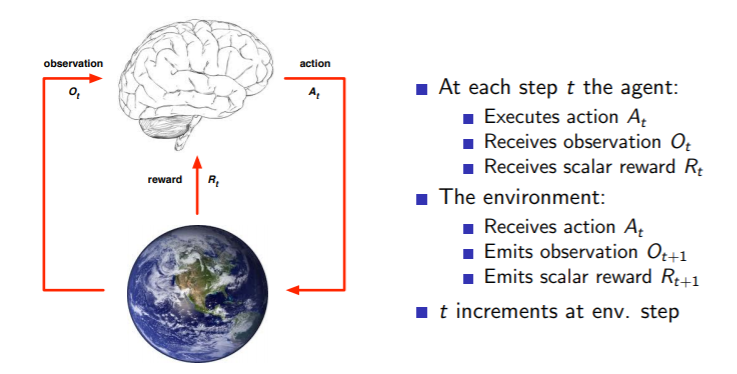
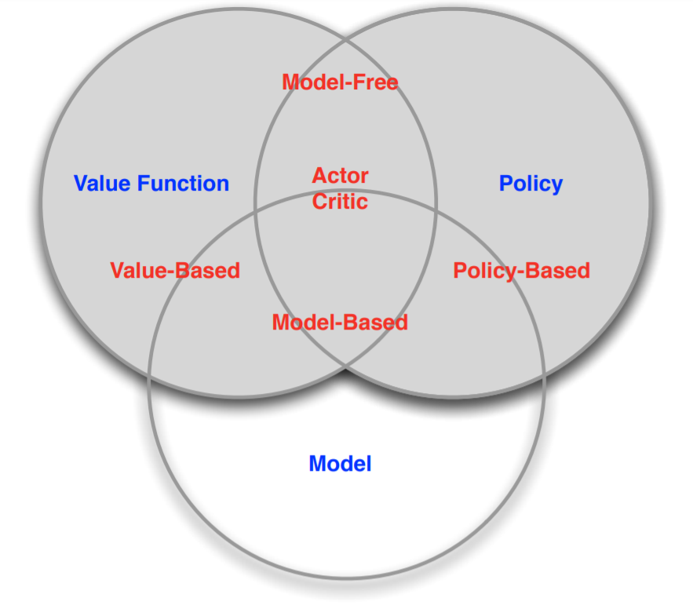

# Introduction to Reinforcement Learning

[Lecture](https://www.youtube.com/watch?v=2pWv7GOvuf0&list=PLqYmG7hTraZDM-OYHWgPebj2MfCFzFObQ), [Slides](http://www0.cs.ucl.ac.uk/staff/d.silver/web/Teaching_files/intro_RL.pdf)

Characteristics of Reinforcement Learning :
* No supervisor, only a **reward** signal
* Feedback is delayed
* Time really matters (sequential, non i.i.d data)
* Agent's action affect the subsequent data it receives

Examples of Application : 
* Fly stunt manoeuvres in a helicopter
* Defeat the world champion at Backgammon
* Manage an investment portfolio
* Control a power station
* Make a humanoid robot walk
* Play many different Atari games better than humans

Objective of an agent is to **maximise cumulative reward**. 

In a RL task there is this infinite loop :

The agent can only control its action.

We define the history as the sequence of observations, actions, rewards of past events. 

A state  is **Markov** if and only if  
If a state is a **Markov state** then it contains all useful information from the history (i.e the history may be thrown away).

There are 2 types of environment : 
* **Fully observable environment** (defined by MDP). Agent sees  
* **Partially observable environment** (defined by POMDP). Agent must construct its own representation of the environment state (i.e. a kind of environment state prediction based on the part he sees)

An RL agent must include one or more of these components : 
* **Policy** : agent's behaviour function (for *deterministic policy* : , for *stochastic policy* : ) 
* **Value function** : how good is each state and/or action. It's a prediction of future *discounted* reward. ()
* **Model** : agent's representation of the environment, predicts how environment will be updated  and the next immediate reward 

Taxonomy of different types of RL agents, based on what they have : 
* Value based
    * No policy (Implicit)
    * Value Function
* Policy based 
    * Policy 
    * No Value function
* Actor Critic
    * Policy 
    * Value function

* Model Free
    * Policy and/or Value function
    * No model
* Model Based
    * Policy and/or Value function
    * Model

## Problems in RL

In **RL** the environment is initially unknown by the agent, but rules are learnt by interacting with the environnement.
Whereas in **Planning** a model of the environnment is known (e.g. exact tree search).   

Rl is like **trial-and-error learning**.

**Exploration vs Exploitation** :
* **Exploration** finds more information about the environment.

* **Exploitation** exploits known information to maximize rewards.

**Prediction vs Control** :

* **Prediction** problem : *evaluate the future*, given a policy

* **Control** problem : *optimize the future*, find the best 
policy