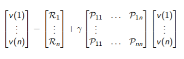

# Lecture 2 - Markov Decision Process

[Lecture](https://www.youtube.com/watch?v=lfHX2hHRMVQ&t=4s), [Slides](http://www0.cs.ucl.ac.uk/staff/d.silver/web/Teaching_files/MDP.pdf)

## Markov Process

Markov decision process *formally* describe an environment for reinforcement learning.

Where the environment is **fully** observable.

(Partially observable problems can be converted into MDPs)

**Bandits** are MDPs with one state.

### Markov property :
 

### State transition Matrix 

The state transition probablity is defined by

We can define the state transition matrix thanks to all 

A **Markov process** is a tyle (S, P), where : 
* S is a (finite) set of state
* P is a state transition probability matrix

## Markov Reward Process

A markov reward process is a tuple **(S, P, R, )**
* S is a (finite) set of state
* P is a state transition probability matrix
* R is a reward function, 
*   is a discount factor, 

**Return** 
*  close to 0 leads to interest in long-term rewards
*  close to 1 leads to interest in short-term rewards
*  avoids infinite returns in cycle ( is ok if all sequences terminate)

**Value function V(s)**
The state value function V(s) of an MRP is the expected return starting from state s.
v(s) = E[G_t|S_t=s]

**Bellman Equation for MRPs**
The value function can be decomposed intro 2 parts :
* immediate reward 
* discounted value of successor state 

Using matrices : 

It can be solved directly 

It's computational complecity is  for n states => not feasible for big MRPs.

## Markov Decision Process (MDP)

A Markov Decision Process is a tuple 
* S is a finite set of states
* A is a finite set of actions
* P is a state transition probability matrix, 
* R is a reward function, 
*  is a discount factor 

###  Policy 
A **policy**  is a distribution over actions given states.

* A policy fully defines the behaviour of an agent
* Policies are stationary (time-independent)
* We have : 
* And 

### Value function

The **state-value function ** of an MDP is :

The **action-value fnction ** is : 

### Bellman Expectation equation 

* 
* 

Link between these 2 notions :

Putting the first equation in the second one, we've got in matrice format : 

 

The **optimal state-value function ** is : 

The **optimal action-value function ** is : 

### Theorem  
For any MDP, there exists an optimal policy.

### Bellman Optimality Equation 

 

This makes the Bellman Optimality Equation *non-linear*. In general there isn't a closed form solution.
But there are iterative solution methods : 
* Value iteration
* Policy iteration
* Q-learning
* Sarsa

## Extension to MDPs

There are other forms of MDPs which are : 
* Infinite and continuous MDPs
* Partially observable MDPs (POMDP)
* Undiscounted, average reward MDPs

A *POMDP* is a tuple 
* S is a finite set of states
* A is a finite set of actions
* O is a finite set of observations
* P is a state transition probability matrix, 
* R is a reward function, 
* Z is an observation function, 
*  is a discount factor 
