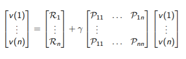

# Lecture 2 - Markov Decision Process

[Lecture](https://www.youtube.com/watch?v=lfHX2hHRMVQ&t=4s), [Slides](http://www0.cs.ucl.ac.uk/staff/d.silver/web/Teaching_files/MDP.pdf)

## Markov Process

Markov decision process *formally* describe an environment for reinforcement learning.

Where the environment is **fully** observable.

(Partially observable problems can be converted into MDPs)

**Bandits** are MDPs with one state.

### Markov property :
 

### State transition Matrix 

The state transition probablity is defined by

We can define the state transition matrix thanks to all 

A **Markov process** is a tyle (S, P), where : 
* S is a (finite) set of state
* P is a state transition probability matrix

## Markov Reward Process

A markov reward process is a tuple **(S, P, R, $\gamma$)**
* S is a (finite) set of state
* P is a state transition probability matrix
* R is a reward function, $R_s = E[R_{t+1} | S_t=s]$
* $\gamma$  is a discount factor, $\gamma \in [0,1]$

**Return** $G_t = R_{t+1} + \gamma R_{t+2} + ... = \sum^\infty_{k=0} \gamma^k R_{t+k1}$
* $\gamma$ close to 0 leads to interest in long-term rewards
* $\gamma$ close to 1 leads to interest in short-term rewards
* $\gamma$ avoids infinite returns in cycle ($\gamma = 1$ is ok if all sequences terminate)

**Value function V(s)**
The state value function V(s) of an MRP is the expected return starting from state s.
v(s) = E[G_t|S_t=s]

**Bellman Equation for MRPs**
The value function can be decomposed intro 2 parts :
* immediate reward $R_{t+1}$
* discounted value of successor state $\gamma v(S_{t+1})$

\begin{align*}
v(s) =& E[G_t | S_{t} = s]\\
     =& E[ R_{t+1} + \gamma  R_{t+2} + \gamma^2 R_{t+2}+ ... | S_t = s]\\  
     =& E[ R_{t+1} + \gamma G_{t+1} | S_t = s]\\
     =& E[ R_{t+1} + \gamma v(S_{t+1}) | S_t = s]\\
     =& R_s + \gamma \sum_{s' \in S} P_{ss'}v(s')
\end{align*}

Using matrices : $v = R + \gamma P v$

It can be solved directly 

$v = (I - \gamma P)^{-1} R$

It's computational complecity is $O(n^3)$ for n states => not feasible for big MRPs.

## Markov Decision Process (MDP)

A Markov Decision Process is a tuple $(S, A, P, R, \gamma)$
* S is a finite set of states
* A is a finite set of actions
* P is a state transition probability matrix, $P_ss'^a = P[S_{t+1}=s' | S_t= s, A_t = a]$
* R is a reward function, $R_s^a = E[R_{t+1} | S_t= s, A_t = a]$
* $\gamma$ is a discount factor $\gamma \in [0,1]$

###  Policy 
A **policy** $\pi$ is a distribution over actions given states.
$\pi(a|s) = P(A_t=a|S_t=s)$

* A policy fully defines the behaviour of an agent
* Policies are stationary (time-independent)
* We have : $P^\pi_{ss'} = \sum_{a\in A} \pi(a|s) P^a_{ss'}$
* And $R^\pi_{s} = \sum_{a\in A} \pi(a|s) R^a_{s}$

### Value function

The **state-value function $v_\pi(s)$** of an MDP is :
$v_\pi(s) = E_\pi[G_t | S_t = s]$

The **action-value fnction $q_\pi(s, a)$** is : 
$q_\pi(s, a) = E_\pi[G_t | S_t = s, A_t = a]$

### Bellman Expectation equation 

* $v_\pi (s) = E_\pi[R_{t+1} + \gamma v_\pi(S_{t+1})| S_t=s]$
* $q_\pi (s, a) = E_\pi[R_{t+1} + \gamma q_\pi(S_{t+1}, A_{t+1})| S_t=s, A_t = a]$

Link between these 2 notions :

$v_\pi = \sum_{a \in A} \pi(a|s)q_\pi(s, a)$

$q_\pi = R_s^a + \gamma \sum_{s' \in S} P_{ss'}^a v_\pi(s')$

Putting the first equation in the second one, we've got in matrice format : 

$v_\pi = R^\pi + \gamma P^\pi v_\pi$ 

The **optimal state-value function $v_*(s)$** is : 
$v_*(s) = \underset{\pi}{max} v_\pi(s)$

The **optimal action-value function $q_*(s, a)$** is : 
$q_*(s, a) = \underset{\pi}{max} q_\pi(s, a)$

### Theorem  
For any MDP, there exists an optimal policy.

### Bellman Optimality Equation 

$v_*(s) = \underset{a}{max} q_*(s, a)$ 

This makes the Bellman Optimality Equation *non-linear*. In general there isn't a closed form solution.
But there are iterative solution methods : 
* Value iteration
* Policy iteration
* Q-learning
* Sarsa

## Extension to MDPs

There are other forms of MDPs which are : 
* Infinite and continuous MDPs
* Partially observable MDPs (POMDP)
* Undiscounted, average reward MDPs

A *POMDP* is a tuple $(S, A, O, P, R, Z, \gamma)$
* S is a finite set of states
* A is a finite set of actions
* O is a finite set of observations
* P is a state transition probability matrix, $P_ss'^a = P[S_{t+1}=s' | S_t= s, A_t = a]$
* R is a reward function, $R_s^a = E[R_{t+1} | S_t= s, A_t = a]$
* Z is an observation function, $Z^a_{s'o} = P[O_{t+1} = o | S_{t+1} = s', A_t = a]$
* $\gamma$ is a discount factor $\gamma \in [0,1]$
