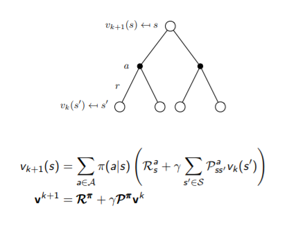
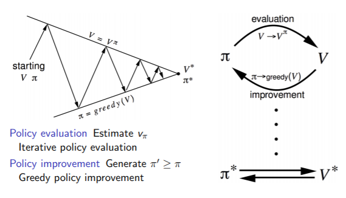
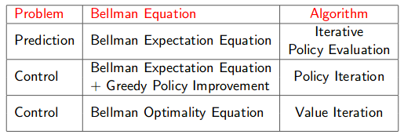

# Lecture 3 : Planning by Dynamic Programming

[Lecture](https://www.youtube.com/watch?v=Nd1-UUMVfz4), [Slides](http://www0.cs.ucl.ac.uk/staff/d.silver/web/Teaching_files/DP.pdf)

## Introduction

*Dynamic* sequential or temporal component to the problem

*Programming* optimising a "program" (i.e policy)

*Dynamic programming* is a very general solution method for problems which have 2 properties :
* Optimal substructure (i.e combining optimal solution for substructure give optimal solution)
* Overlapping subproblems

MDP satisfy these both property (<3 Markov property & Bellman equation)

**Dynamic programming assumes full knowledge of the MDP**. It is used for planning in an MDP, for prediction (~evaluation a policy ??). Or control (finding the best policy)... (But is also used in other fields).

## Policy Evaluation

**Problem** : How to evaluate a given policy .

**Solution** : iterative application of Bellman expaction backup.

Using **synchronous backups** :
At each iteration k+1 :
* For all states 
* Update  from 
* where s' is a successor state of s

GridWorld application can be found [[here]](./Applications/policy_evaluation_grid_world.py)

## Policy Iteration

*How to improve our policy ?*

* Given a policy 
    * Evaluate the policy 
    
    ($v_\pi(s) = E[R_{t+1} + \gamma T_{t+2} + ... | S_t = s]$)
    * Improve the policy by acting greedily with respect to 
    
    $v_\pi$ ($\pi' = greedy(v_\pi)$)

In a small GridWorld env 1 iteration is enough. But in general more iterations is necesary.
This process always converges to the optimal policy .

More formally :

* Consider a deterministic policy, 
* We can improve the policy by acting greedily 
* This imporoves the value from any stat s over one step

* It therefore improves the value function, 
* If improvements stop, q, then the Bellman optimality equation is satisfied. So  is an optimal policy.

GridWorld application can be found [[here]](./Applications/policy-iteration_grid_world.py)

## Value Iteration

Any optimal pollicy can be subdivided into 2 components :
* an optimal first action
* followed by an optimal policy from successor state

### Deterministic Value Iteration

* If we know the solution to subproblems 
* Then solution  can be found by one-step lookahead, 
* The idea of value iteation is to apply these updates iteratively

To sum up, we have built 3 different *synchronous* algorithms : 

## Extensions to Dynamic Programming 

Extensions to dynamic programming are :
*  *Asynchronous* dynamic programming. States are backs up individually. Can reduce computation.
* In-place dynamic programming
* Prioritised sweeping, back-up state with the largest remaining Bellman error
* Real-time dynamic programming, use of agent experience 
