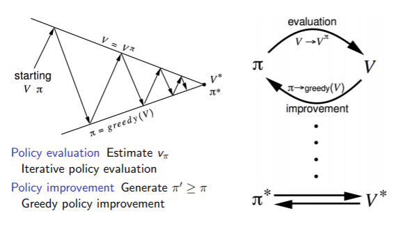
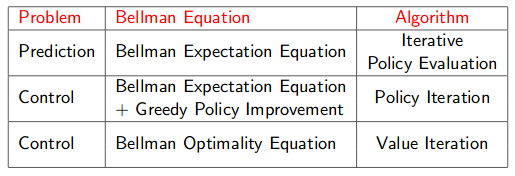

# Lecture 3 : Planning by Dynamic Programming

[Lecture](https://www.youtube.com/watch?v=Nd1-UUMVfz4), [Slides](http://www0.cs.ucl.ac.uk/staff/d.silver/web/Teaching_files/DP.pdf)

## Introduction

*Dynamic* sequential or temporal component to the problem

*Programming* optimising a "program" (i.e policy)

*Dynamic programming* is a very general solution method for problems which have 2 properties :
* Optimal substructure (i.e combining optimal solution for substructure give optimal solution)
* Overlapping subproblems

MDP satisfy these both property (<3 Markov property & Bellman equation)

**Dynamic programming assumes full knowledge of the MDP**. It is used for planning in an MDP, for prediction (~evaluation a policy ??). Or control (finding the best policy)... (But is also used in other fields).

## Policy Evaluation

**Problem** : How to evaluate a given policy $\pi$.

**Solution** : iterative application of Bellman expaction backup.

$v_1 => v_2 => ... => v_\pi$

Using **synchronous backups** :
At each iteration k+1 :
* For all states $s \in S$
* Update $v_{k+1}(s)$ from $v_k(s')$
* where s' is a successor state of s

GridWorld application can be found [[here]](./Applications/policy_evaluation_grid_world.py)

## Policy Iteration

*How to improve our policy ?*

* Evaluate the policy 
    
($v_\pi(s) = E[R_{t+1} + \gamma T_{t+2} + ... | S_t = s]$)

* Improve the policy by acting greedily with respect to 

$v_\pi$ ($\pi' = greedy(v_\pi)$)

In a small GridWorld env 1 iteration is enough. But in general more iterations is necesary.
This process always converges to the optimal policy $\pi^*$.

More formally :

* Consider a deterministic policy, $a = \pi(s)$
* We can improve the policy by acting greedily $\pi'(s) = \underset{a \in A}{argmax} q_\pi(s,a)$
* This imporoves the value from any stat s over one step
$q_\pi(s, \pi'(s)) = \underset{a \in A}{q_\pi(s,a)} \geq q_\pi(s, \pi(s)) = v_\pi(s)$

* It therefore improves the value function, $v_\pi'(s) \qeq v_\pi(s)$
* If improvements stop, q$_\pi(s, \pi'(s)) = q_\pi(s , \pi(s))$, then the Bellman optimality equation is satisfied. So $\pi$ is an optimal policy.

GridWorld application can be found [[here]](./Applications/policy-iteration_grid_world.py)

## Value Iteration

Any optimal pollicy can be subdivided into 2 components :
* an optimal first action
* followed by an optimal policy from successor state

### Deterministic Value Iteration

* If we know the solution to subproblems $v_*(s')$
* Then solution $v_*(s)$ can be found by one-step lookahead, $v*(s) \leftarrow \underset{a \in A}{max} R_s^a + \gamma \sum_{s' \in S} P^a_{ss'}v_*(s')$
* The idea of value iteation is to apply these updates iteratively

To sum up, we have built 3 different *synchronous* algorithms : 

## Extensions to Dynamic Programming 

Extensions to dynamic programming are :
*  *Asynchronous* dynamic programming. States are backs up individually. Can reduce computation.
* In-place dynamic programming
* Prioritised sweeping, back-up state with the largest remaining Bellman error
* Real-time dynamic programming, use of agent experience 
