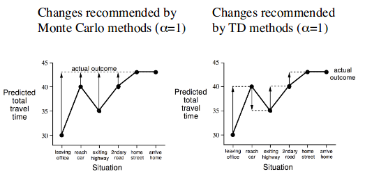
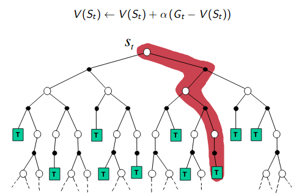
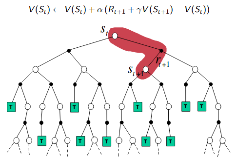
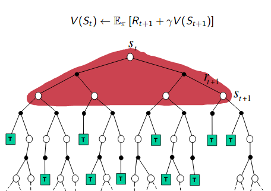
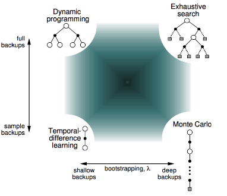

# Lecture 4 : Model-Free Prediction

## Introduction

In model-free methods, the **MDP** that rules the world is **unknown**.

## Monte-Carlo (MC) Learning

MC methods learn directly from episodes of experience

MC is a model-free : no knowledge of MDP transitions/rewards

**MC learns from complete episodes : no boostrapping** 

**Goal** learn $v_\pi$ from episodes of experience under policy $\pi$. ($S_1,A_1,R_2,...,S_k ~ \pi)$

Recall :
* *return* G is the total discounted reward

$G_t = R_{t+1} + \gamma R_{t+2] + ... + \gamma^{T-1} R_T$

* Value function is the expected return

$v_\pi(s) = E_\pi[G_t | S_t = s]$

### First-visit Monte-Carlo Policy Evaluation

The first time-step t that state s is visited in an episode 

1. Increment counter $N(s) \leftarrow N(s) +1$

2. Increment total return with the return $S(s) \leftarrow S(s) + G_t$

3. Value is estimated by mean return V(s) = S(s) / N(s)

4. By law a large numbers, $V(s) \leftarrow v_\pi(s)$ as $N(s) \leftarrow \infty$

### Every-Visit Monte-Carlo Policy Evaluation

Every time-step t that state s is visited in an episode

1. Increment counter $N(s) \leftarrow N(s) + 1$ 
2. Increment total return $S(s) \leftarrow S(s) + G_t$
3. Value is estimated by mean return $V(s) = S(s) / N(s)$
4. Again, by law a large numbers, $V(s) \leftarrow v_\pi(s)$ as $N(s) \leftarrow \infty$

**Application** on Black-jack [[here]](./Applications/monte_carlo_policy_evaluation.ipynb)

**Monte Carlo policy evaluation uses empiral mean return instead of expected return** 

### Incremental Monte-Carlo updates

Use the formula of the *incremental mean* :
$\mu_{k+1} = \mu_k + \frac{1}{k+1} (x_k -\mu_k) $. Which gives :
* $N(S_t) \leftarrow N(S_t) + 1$
* $V(S_t) \leftarrow V(S_t) + \frac{1}{N(S_t))(G_t - V(S_t))$

In non-stationary problems, it can be useful to track a running mean (i.e to forget old episodes) : 
$ V(S_t) \leftarrow V(S_t) + \alpha (G_t - V(S_t))$

## Temporal-Difference Learning

TD learns from **incomplete episodes** by *boostrapping*
TD is model-free, learn directly from experience

In *Incremental every-visit MC* we had : 
    $V(S_t) \leftarrow V(S_t) + \alpha ( \textcolor{red}{G_t} - V(S_t))$ 
which means that we move a litte bit in the direction given by the current error.

In TD(0) we use the same idea but we leverage the Bellman equation to learn from incomplete sequence : 
$V(S_t) \leftarrow V(S_t) + \alpha ( \textcolor{red}{R_{t+1} + \gamma V(S_{t+1})} - V(S_t))$

$ R_{t+1} + \gamma V(S_{t+1})$ is called the *TD target*

$\delta_t = R_{t+1} + \gamma V(S_{t+1}) - V(S_t)$ is called the *TD error*

TD can learn *before* knowing the final outcome, MC can't. 

### Bias/Variance Trade-Off
Return $G_t = R_{t+1} + \gamma ...$ is unbiased estimate of $v\pi(S_t)$
TD target $R_{t+1} + \gamma V(S_{t+1})$ is biased estimate of $v_\pi(S_t)$ but lower variance because return is full of noise (random actions, transition, rewards)

TD exploits Markov property and is then more efficient in Markov environments. In other case, MC is more efficient.

### Unified View - Backups

**Monte-Carlo** backup  

**TD** backup

**Dynamic programming** backup

### Bootstrapping and Sampling

**Boostrapping** use your estimate of the return
* MC does not bootstrap
* DP bootstraps
* TD bootstraps

**Sampling** update samples an expectation
* MC samples
* DP does not sample
* TD samples

## TD($\lambda$)

TD(0) = look 1 step into the future ($G_t = R_{t+1} + \gamma V(S_{t+1})$)

TD(1) = look 2 steps ino the future ($G_t = R_{t+1} + \gamma R_{t+2} + \gamma^2 V(S_{t+2})$)

TD(n) = ...

TD($\infty$) = Monte-Carlo

TD($\lambda$) : averaging (with weight $(1-\lambda)\lambda^{n-1}$) the return of all time-steps. $G_t^\lambda = (1-\lambda) \sum_{n=1}^\infty \lambda^{n-1} G_t^{(n)}$ where $G_t^{(n)}$ is the return of TD(n).

