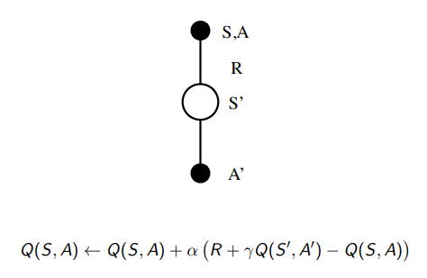
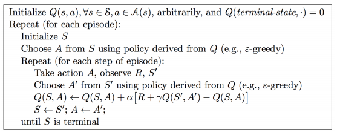
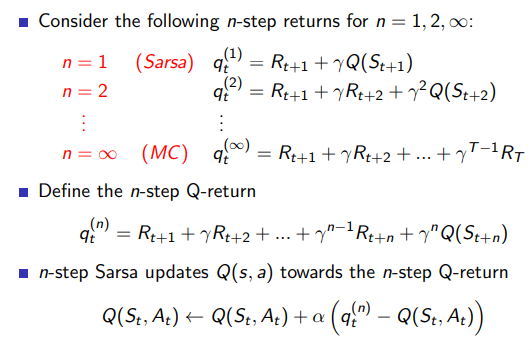
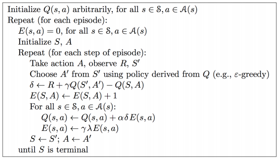
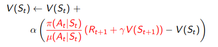
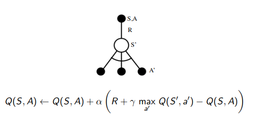
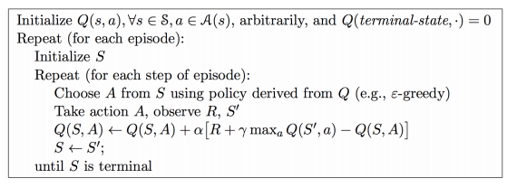
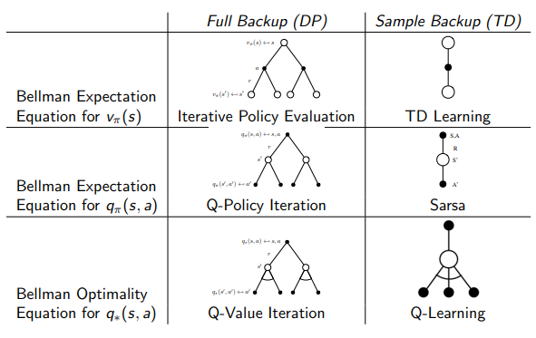
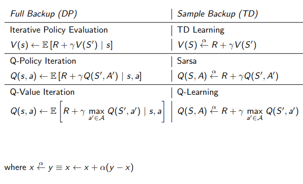

# Lecture 5 : Model-Free Control

[Lecture](https://www.youtube.com/watch?v=0g4j2k_Ggc4&list=PLqYmG7hTraZDM-OYHWgPebj2MfCFzFObQ&index=5), [Slides](http://www0.cs.ucl.ac.uk/staff/d.silver/web/Teaching_files/control.pdf)

## Introduction

Find the best policy without knowing the MDP that rules the world.

* **On-policy** learning : "learn on the job", learn about policy  from experience sampled from 

* **Off-policy** learning : "look over someone's shoulder, learn about policy  from experience sampled from 

## On-Policy Monte-Carlo Control

With value iteration, we were doing a greed policy improvement over  but that requires model of MDP :

But we want to be model-free...

So Greedy policy improvement over Q(s, a) which is model-free :

With model-free methods we need to introduce an exploratory strategy in order to make sure to visit everything.

**\epsilon-greedy exploration** : 
* every actions are tried with non-zero probability for every states
* with probability  choose the greedy action
* with probability  choose an action at random

### Theorem

For any -greedy policy , the -greedy policy  with respect to  is an improvement, i.e 

Can be proven in a few lines...

### Monte-Carlo Control

Every episode : 
* Policy evaluation : Monte-Carlo policy evaluation 
* Policy improvement : -greedy improvement

### GLIE : Greedy in the Limit with Infinite Exploration
* All state-action pairs are explored infinitely many times
* The policy converges on a greedy policy

-greedy is GLIE for  for example.

### GLIE Monte-Carlo Control

* Sample kth episode using 
* For each state  and action  in the episode

* Improve policy based on new action-value function

**TODO** application on Black-jack

## On-Policy Temporal-Difference Learning

### SARSA :

Global idea : use TD instead of MC in our control loop

**Theorem** 

SARSA converges to the optimal action-value function, under the following conditions :
* GLIE sequence of policies 
* Robbins-Monro squence of step-sizes 

### n-step Sarsa

### Sarsa()

Average all n-steps Sarsa :

Forward view : 

### Backward-view Sarsa()

Use **eligibility traces** in an online algorithm

Sarsa() has one eligibiliy trace for each state-action pair
* 
* 

 is updated for every state and action

In proportion to the TD-error  and eligibility trace 
* 
* 

To sum up, the final algorithm is : 

## Off-Policy Learning

Evaluate **target policy**  to compute  or 

While **following behaviour** policy 

Interest : 
* Learn  from observing humans or other agents
* Re-use experience generated from old policies
* Learn about *optimal* policy while following *exploratory* policy
* Learn about *multiple* policies while following one policy

### Importance Sampling for Off-Policy TD

* Use TD targets generated from  to evalute 
* Weight TD target  by importance sampling
* Only need a single importance sampling correction

### Q-learning

* We now consider off-policy learning of action-value Q(s, a)
* No importance sampling is required
* Next action is chosen using behaviour policy 
* But we consider alternantive succesor action 
* And update  towards value of alternative action

### Off-policy Control with Q-learning 

## Summary

