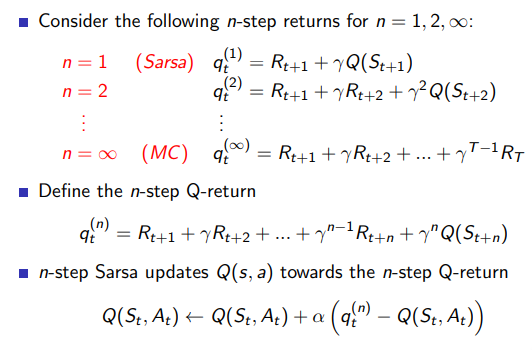
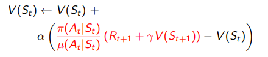
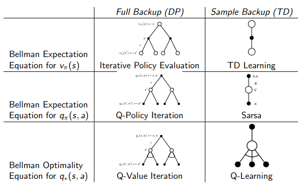

# Lecture 5 : Model-Free Control

## Introduction

Find the best policy without knowing the MDP that rules the world.

* **On-policy** learning : "learn on the job", learn about policy $\pi$ from experience sampled from $\pi$

* **Off-policy** learning : "look over someone's shoulder, learn about policy $\pi$ from experience sampled from $\mu$

## On-Policy Monte-Carlo Control

With value iteration, we were doing a greed policy improvement over $V(s)$ but that requires model of MDP :

$\pi'(s) = \underset{a \in A}{arg max} R_s^a + P_{ss'}^a V(s')$

But we want to be model-free...

So Greedy policy improvement over Q(s, a) which is model-free :

$\pi'(s) =  \underset{a \in A}{arg max} Q(s,a)$

With model-free methods we need to introduce an exploratory strategy in order to make sure to visit everything.

**\epsilon-greedy exploration** : 
* every actions are tried with non-zero probability for every states
* with probability $1-\epsilon$ choose the greedy action
* with probability $\epsilon$ choose an action at random

### Theorem

For any $\epsilon$-greedy policy $\pi$, the $\epsilon$-greedy policy $\pi'$ with respect to $\q_\pi$ is an improvement, i.e $v_\pi'(s) > v_\pi(s)$

Can be proven in a few lines...

### Monte-Carlo Control

Every episode : 
* Policy evaluation : Monte-Carlo policy evaluation $Q \approx q_\pi$
* Policy improvement : $\epsilon$-greedy improvement

### GLIE : Greedy in the Limit with Infinite Exploration
* All state-action pairs are explored infinitely many times
* The policy converges on a greedy policy

$\epsilon$-greedy is GLIE for $\epsilon_k = 1/k$ for example.

### GLIE Monte-Carlo Control

* Sample kth episode using $\pi$
* For each state $S_t$ and action $A_t$ in the episode

$N(S_t, A_t) \leftarrow N(S_t, A_t) + 1$

$Q(S_t, A_t) \leftarrow Q(S_t, A_t) + (G_t - Q(S_t, A_t))/N(S_t, A_t) $

* Improve policy based on new action-value function

$\epsilon \leftarrow 1/k$

$\pi \leftarrow \epsilon-greedy(Q)$

**TODO** application on Black-jack

## On-Policy Temporal-Difference Learning

### SARSA :

Global idea : use TD instead of MC in our control loop

**Theorem** 

SARSA converges to the optimal action-value function, under the following conditions :
* GLIE sequence of policies $\pi_t(a|s)$
* Robbins-Monro squence of step-sizes $\alpha_t$

$\sum_{t=1}^\infty = \infty$
$\sum_{t=1}^\infty \leq \infty$

### n-step Sarsa

### Sarsa($\lambda$)

Average all n-steps Sarsa :

$q_t^\lambda = (1-\lambda) \sum_{n=1}^\infty \lambda^{n-1} q_t^{(n)}$

Forward view : $Q(S_t, A_t) \leftarrow Q(S_t, A_t) + \alpha (q_t^\lambda - Q(S_t, A_t))$

### Backward-view Sarsa($\lambda$)

Use **eligibility traces** in an online algorithm

Sarsa($\lambda$) has one eligibiliy trace for each state-action pair
* $E_0(s,a) = 0$
* $E_t(s, a) = \gamma \labmda E_{t-1} (s,a) + I(S_t = s, A_t = a)$

$Q(s, a)$ is updated for every state and action

In proportion to the TD-error $\delta_t$ and eligibility trace $E_t(s,a)$
* $\delta_t = R_{t+1} + \gamma Q(S_{t+1}, A_{t+1}) - Q(S_t, A_t)$
* $Q(s, a) \leftarrow Q(s, a) + \alpha \delta_t E_t(s,a)$

To sum up, the final algorithm is : 

## Off-Policy Learning

Evaluate **target policy** $\pi(a|s)$ to compute $v_\pi(s)$ or $q_\pi(s,a)$

While **following behaviour** policy $\mu(s|a)$

Interest : 
* Learn  from observing humans or other agents
* Re-use experience generated from old policies
* Learn about *optimal* policy while following *exploratory* policy
* Learn about *multiple* policies while following one policy

### Importance Sampling for Off-Policy TD

* Use TD targets generated from $\mu$ to evalute $\pi$
* Weight TD target $R + \gamma V(s')$ by importance sampling
* Only need a single importance sampling correction

### Q-learning

* We now consider off-policy learning of action-value Q(s, a)
* No importance sampling is required
* Next action is chosen using behaviour policy $A_{t+1} \sim \mu( . | S_t)$
* But we consider alternantive succesor action $A' \sim \pi(. | S_t)$
* And update $Q(S_t, A_t)$ towards value of alternative action

$Q(S_t, A_t) \leftarrow Q(S_t, A_t) + \alpha (R_{t+1} + \gamma Q(S_{t+1} , A') - Q(S_t, A_t))$

### Off-policy Control with Q-learning 

## Summary

