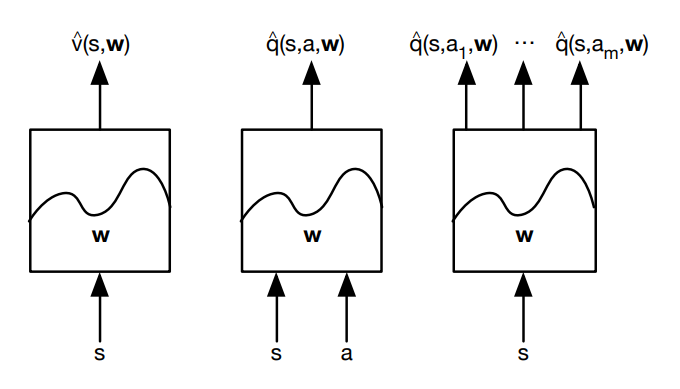
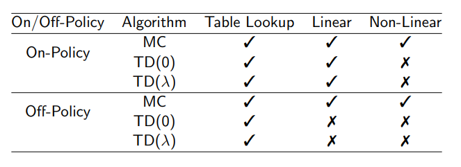
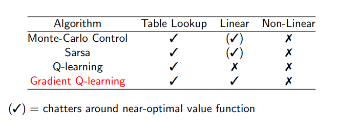

# Lecture 6 : Value Function Approximation

[Lecture](https://www.youtube.com/watch?v=UoPei5o4fps&index=6&list=PLqYmG7hTraZDM-OYHWgPebj2MfCFzFObQ), [Slides](http://www0.cs.ucl.ac.uk/staff/d.silver/web/Teaching_files/FA.pdf)

**Applications** :  Linear function approximation [[here]](./applications/mountain_car_linear_func_approx.py)

## Introduction

We need value function approximation to solve large problems.

So far we have represente value function by a *look up* table
* V(s)
* Q(s, a)

For large MDPs it is not scalable
* too many states/actions
* too slow to learn value of each state **separately**

Solution :
* 
* 
* Generalise to unseen states
* Update parameter w using MC or TD learning

### Type of value function approximation

## Incremental Methods

Update the value function in direction of the gradient given by :
* For MC, the target is the return 

* For TD(0), the target is the TD target 

* For , the target is the -return 

We can apply supervised learning to "training data". For example : 
for MC 
same idea for the other methods

### Control with Value Function Approximation

* **Policy evaluation** Approximate policy evaluation
* **Policy improvement** -greedy policy improvement

### Convergence of prediction algorithm

## Batch Methods

### Experience Replay 

Given experience consisting of (state, value) pairs
 

Repeat : 
1. Sample state, value from experience
2. Apply stochastic gradient descent update

### Deep Q-Networks with Experience Replay 

DQN uses experience replay and fixed Q-targets
* Take action  according to -greedy policy 
* Store transition  in replay memory D
* Sample random mini-batch transitions  from D
* Compute Q-learning targets wrt old fixed  parameters 
* Optimise MSE between Q-network and Q-learning targets

$L_i(w_i) = E_{s,a,r,s ~ D_i} [(r + \gamma \underset{a'}{max} Q(s', a', w_i^-) - Q(s, a, w_i)^2)]
* Using variant of stochastic gradient descent

### DQN in Atari 

* End to end learning of values Q(s, a) from pixels
* Input state s is stack of raw pixels from last 4 frames
* Ouput is Q(s, a)
* Reward is change in score
 